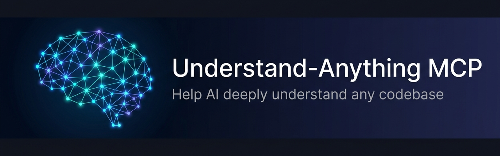
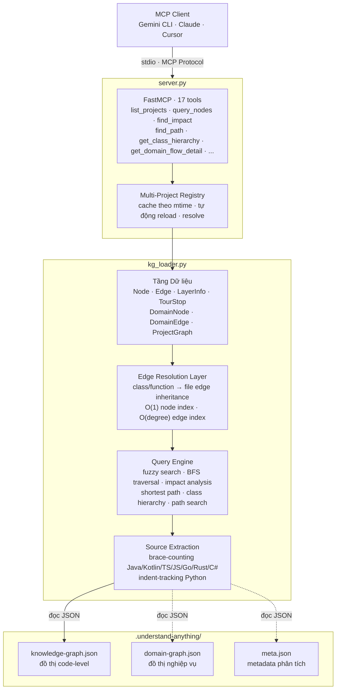

<div align="center">



# 🧠 Understand-Anything MCP Server

**MCP Server giúp trợ lý AI hiểu sâu bất kỳ codebase nào thông qua Knowledge Graph.**

[](https://www.python.org/downloads/)
[](https://modelcontextprotocol.io)
[](LICENSE)

</div>

---

## Giới thiệu

MCP Server này tải các Knowledge Graph được tạo bởi [Understand-Anything](https://github.com/understand-anything) và cung cấp chúng dưới dạng các tool có thể truy vấn cho bất kỳ trợ lý AI tương thích MCP nào (Gemini CLI, Claude Desktop, Cursor, v.v.).

Server hỗ trợ **hai loại đồ thị** đồng thời cho mỗi dự án:

| Đồ thị | Tệp | Nội dung |
|---|---|---|
| **Code Graph** | `knowledge-graph.json` | Files, functions, classes, imports, chuỗi gọi hàm, các tầng kiến trúc |
| **Domain Graph** | `domain-graph.json` | Nghiệp vụ (domains), luồng xử lý (flows), bước (steps), thực thể, quy tắc nghiệp vụ |

**Hỗ trợ đa dự án** — Tải N dự án cùng lúc và truy vấn bất kỳ dự án nào. AI tự động nhận diện dự án phù hợp dựa trên ngữ cảnh workspace.

### Tính năng nổi bật

- 🔍 **Tìm kiếm mờ (Fuzzy search)** — Tìm kiếm có trọng số (tên 3x > mô tả 1.5x > tags 1x) sử dụng `rapidfuzz`
- 🏗️ **Tầng kiến trúc** — Truy vấn theo layer (controller, service, repository, v.v.)
- 🌊 **Truy vết chuỗi gọi hàm** — Duyệt BFS theo các lời gọi hàm
- 💥 **Phân tích vùng ảnh hưởng** — Tìm tất cả node bị ảnh hưởng khi thay đổi một node (BFS ngược)
- 🎯 **Phát hiện entry point** — Nhận diện API endpoint và các hàm không được gọi bởi hàm khác
- 🏢 **Tri thức nghiệp vụ** — Domains, flows, steps, thực thể và quy tắc nghiệp vụ
- 📖 **Trích xuất mã nguồn đa ngôn ngữ** — Đọc source code thực tế của bất kỳ node nào, hỗ trợ trích xuất symbol-level cho **Java, Kotlin, TypeScript, JavaScript, Python, Go, Rust, C#**
- 🔗 **Tìm đường ngắn nhất** — BFS vô hướng giữa hai node bất kỳ trong đồ thị
- 🏛️ **Cây kế thừa** — Truy vết extends/implements lên và xuống toàn bộ hệ thống phân cấp class
- 📁 **Tìm kiếm theo đường dẫn** — Tìm tất cả node theo package/module/thư mục path (O(P) qua path index)
- 🌉 **Domain↔Code Cross-reference** — Tự động bridge từ domain step → code node qua `_nodes_by_path` index O(1), semantic ranking khi prefix match (penalize boilerplate, ưu tiên class liên quan theo tên/mô tả/tags)
- 🔄 **Tự động tải lại** — Phát hiện khi file graph thay đổi trên đĩa và tự động reload
- ✅ **Phân tích độ mới** — So sánh commit hash của graph với HEAD hiện tại qua `git diff`
- ⚡ **Edge Resolution Layer** — Class và function node tự động kế thừa quan hệ từ file cha, tra cứu O(degree) qua edge index
- 🧪 **59 unit tests** — Bộ test toàn diện bảo vệ regressions, chạy trong <0.1s

---

## Bắt đầu nhanh

### Yêu cầu

- Python ≥ 3.12
- Trình quản lý package [`uv`](https://docs.astral.sh/uv/)
- Một dự án đã được tạo graph bởi [Understand-Anything](https://github.com/understand-anything) (thư mục `.understand-anything/`)

### Cài đặt & Chạy

```bash
# Clone repository
git clone https://github.com/VIethoangnguyenle/Understand-Anything-MCP.git
cd Understand-Anything-MCP

# Cài đặt dependencies
uv sync

# Chạy với MCP Inspector (để test/debug)
PROJECT_ROOTS=/đường/dẫn/tới/dự-án npx @modelcontextprotocol/inspector uv run server.py

# Chạy MCP dev server
PROJECT_ROOTS=/đường/dẫn/tới/dự-án mcp dev server.py
```

### Đa dự án

Đặt `PROJECT_ROOTS` là danh sách đường dẫn phân cách bằng dấu phẩy:

```bash
PROJECT_ROOTS=/đường/dẫn/dự-án-a,/đường/dẫn/dự-án-b uv run server.py
```

Mỗi tool đều nhận tham số `project` tùy chọn. Nếu chỉ có một dự án được tải, nó sẽ được sử dụng tự động.

---

## Cấu hình MCP Client

### Gemini CLI / Antigravity

Thêm vào `~/.gemini/antigravity/mcp_config.json`:

```json
{
  "understand-anything": {
    "command": "uv",
    "args": ["--directory", "/đường/dẫn/tuyệt/đối/tới/Understand-Anything-MCP", "run", "server.py"],
    "env": {
      "PROJECT_ROOTS": "/đường/dẫn/tới/dự-án-a,/đường/dẫn/tới/dự-án-b"
    }
  }
}
```

### Claude Desktop

Thêm vào `claude_desktop_config.json`:

```json
{
  "mcpServers": {
    "understand-anything": {
      "command": "uv",
      "args": ["--directory", "/đường/dẫn/tuyệt/đối/tới/Understand-Anything-MCP", "run", "server.py"],
      "env": {
        "PROJECT_ROOTS": "/đường/dẫn/tới/dự-án"
      }
    }
  }
}
```

### Cursor / Các MCP Client khác

Sử dụng cùng cấu trúc — đặt `command` là `uv`, truyền đường dẫn server qua `--directory`, và cấu hình `PROJECT_ROOTS` trong `env`.

---

## Danh sách Tools (17 tools)

### Khám phá & Tổng quan

| Tool | Mô tả |
|---|---|
| `list_projects` | Liệt kê tất cả dự án đã đăng ký kèm số lượng node/edge và thông tin domain |
| `get_graph_stats` | Thống kê toàn diện: phân bố type, layers, phân tích độ mới của graph |
| `get_graph_metadata` | Snapshot JSON có cấu trúc: counts, graph commit, repository HEAD, freshness (bản machine-readable của `get_graph_stats`) |
| `get_tour` | Tour hướng dẫn dự án — các điểm dừng được chọn lọc giải thích các thành phần chính |

### Truy vấn Code Graph

| Tool | Mô tả |
|---|---|
| `query_nodes` | Tìm kiếm mờ có trọng số theo từ khóa. Hỗ trợ lọc `node_type` và phân trang |
| `get_node_detail` | Chi tiết đầy đủ của một node theo ID: đường dẫn, layer, độ phức tạp, tags, số lượng quan hệ |
| `get_node_source` | Đọc mã nguồn thực tế của node. Trích xuất symbol-level đa ngôn ngữ (Java/Kotlin/TS/Python/Go/...) |
| `get_relationships` | Tất cả node liên kết kèm loại quan hệ. Class/function tự động kế thừa edge từ file cha |
| `trace_call_chain` | Cây gọi hàm BFS từ một function (theo edge `calls`, độ sâu có thể cấu hình) |
| `get_layer_info` | Liệt kê các tầng kiến trúc hoặc lấy tất cả node trong một layer cụ thể |
| `find_entry_points` | Các function không được gọi bởi function khác — tiềm năng là API endpoint |
| `find_impact` | Vùng ảnh hưởng: tất cả node bị ảnh hưởng nếu node này thay đổi (BFS ngược) |

### Truy vấn nâng cao

| Tool | Mô tả |
|---|---|
| `find_path` | Tìm đường đi ngắn nhất giữa hai node (BFS vô hướng, tối đa 10 hop) |
| `get_class_hierarchy` | Cây kế thừa extends/implements — hỗ trợ hướng `up`/`down`/`both` |
| `search_by_file_path` | Tìm node theo pattern đường dẫn file (O(P) qua path index, case-insensitive) |

### Truy vấn Domain Graph

| Tool | Mô tả |
|---|---|
| `get_domain_overview` | Tổng quan tất cả domain nghiệp vụ kèm flows, thực thể, và mô tả |
| `get_domain_detail` | Chi tiết sâu về một domain: thực thể, quy tắc nghiệp vụ, flows, steps, code cross-ref |
| `get_domain_flow_detail` | Deep-dive vào một flow cụ thể: entry point, ordered steps, code cross-references |

---

## Kiến trúc



### Cấu trúc tệp

```
Understand-Anything-MCP/
├── server.py          # MCP server — định nghĩa 17 tools, registry đa dự án
├── kg_loader.py       # Bộ tải graph & query engine — data models, search, traversal, resolution
├── metrics.py         # Usage metrics — 1 JSON line / tool call, rotating file, fail-safe
├── pyproject.toml     # Cấu hình dự án — dependencies: mcp[cli], rapidfuzz, pytest (dev)
├── scripts/           # Bộ script vận hành — clone, pull, re-index, gitignore
│   ├── clone-repos.sh       # Clone repo từ manifest CSV vào REPO_ROOT (idempotent)
│   ├── git-pull.sh          # Pull toàn bộ repo + report JSON
│   ├── git-pull-run.sh      # Wrapper systemd: lưu JSON, alert webhook
│   ├── sync-graph.sh        # Re-index graph incremental bằng claude agent trong docker
│   ├── sync-graph-run.sh    # Wrapper cron: pull + sync + alert
│   ├── check-graph-ignore.sh    # Kiểm tra .understand-anything/ được ignore đúng
│   ├── revert-gitignore-graph.sh  # Hoán .gitignore sang .git/info/exclude
│   └── test/                  # Harness test (git repo giả + docker giả)
├── tests/             # Bộ test tự động
│   ├── test_kg_loader.py    # Unit tests cho core loader, query engine & cross-ref
│   ├── test_graph_metadata.py  # Tests cho get_graph_metadata
│   ├── test_path_safety.py     # Tests cho path containment
│   ├── test_metrics.py         # Unit tests cho metrics writer
│   ├── test_metrics_integration.py  # Wiring metrics vào FastMCP tool surface
│   └── fixtures/            # Dữ liệu test JSON mẫu
│       ├── knowledge-graph.json
│       └── domain-graph.json
├── uv.lock            # Dependencies đã khóa phiên bản
└── README.md
```

---

## Biến môi trường

| Biến | Bắt buộc | Mô tả |
|---|---|---|
| `PROJECT_ROOTS` | **Có** | Danh sách đường dẫn tuyệt đối phân cách bằng dấu phẩy tới các dự án có thư mục `.understand-anything/` |
| `UPSTREAM_ROOTS` | Không | Danh sách đường dẫn tới thư mục gốc của thư viện upstream/dùng chung (để resolve source code của upstream node) |
| `UA_MCP_METRICS_FILE` | Không | Đường dẫn file JSONL cho usage metrics. Rỗng = disable hoàn toàn (mặc định). Xem section [Usage Metrics](#usage-metrics) |

---

## Usage Metrics

Module `metrics.py` đo usage của tool surface — 1 JSON line cho mỗi tool call, append vào file rotating có size cap. Dữ liệu trả lời ba câu hỏi:

1. **Adoption** — ua-mcp có thực sự được dùng không? Tool nào được gọi, bao nhiêu lần?
2. **Điểm yếu** — Chỗ nào trả về kết quả rỗng, lỗi, hay tool nào không ai gọi (dead tool)?
3. **Hỏi lặp** — Cùng một caller có đang hỏi cùng một câu hỏi không? (detection qua `caller + arg_hash` trong time window)

### Thiết kế an toàn

**Hard rule: ghi metrics không bao giờ được phá tool call.** Mọi failure path đều được swallow (file không ghi được, disk full, JSON không serialize được), và writer tự **disable vĩnh viễn** sau 5 lần lỗi liên tiếp — không còn retry, không còn log spam, tool call chạy tiếp bình thường.

- **Caller key** — hash `ip + user_agent`, không lưu IP raw (tránh PII)
- **Arg hash** — SHA-256 của `(tool, args)`, args dài được truncate trước khi ghi nhưng hash vẫn tính trên bản đầy đủ
- **Outcome classification** — phân loại `ok` / `empty` / `error` / `exception` dựa trên giá trị trả về
- **Rotating file** — size cap, không tăng vô hạn

### Kích hoạt

```bash
# Mặc định: metrics TẮT (không ghi gì)
PROJECT_ROOTS=/đường/dẫn/dự-án uv run server.py

# Bật metrics: set UA_MCP_METRICS_FILE
UA_MCP_METRICS_FILE=/var/log/ua-mcp/metrics.jsonl \
PROJECT_ROOTS=/đường/dẫn/dự-án uv run server.py
```

### Wiring

`server.py` gọi `metrics.install(mcp)` **trước** tool đầu tiên được khai báo bằng `@mcp.tool()`. Vì decorator chạy khi import theo thứ tự source, tool nào khai báo **trên** dòng `install` sẽ không bị đo — test `test_every_registered_tool_is_instrumented` bảo vệ invariant này.

```bash
# Chạy test metrics
uv sync --group dev
uv run pytest tests/test_metrics.py tests/test_metrics_integration.py -v
```

---

## Cách hoạt động

1. **Khi khởi động**, server quét `PROJECT_ROOTS` và tải `knowledge-graph.json` + `domain-graph.json` từ thư mục `.understand-anything/` của mỗi dự án.

2. **Index được xây dựng** trong bộ nhớ:
   - `_node_index`: tra cứu node theo ID — O(1)
   - `_edges_by_source` / `_edges_by_target`: tra cứu edge — O(degree)
   - `_domain_edges_by_source`: index riêng cho domain graph
   - `_nodes_by_path`: ánh xạ file_path → nodes — O(1), dùng cho cross-ref và path search
   - Layer enrichment: gán `layer` vào từng node dựa trên ánh xạ layer

3. **Edge Resolution Layer** — Khi truy vấn quan hệ của class/function node:
   - Resolve tới parent file qua edge `contains`
   - Kế thừa outgoing edges từ file cha (imports, contains, v.v.)
   - Loại bỏ self-reference và deduplicate

4. **Khi một tool được gọi**, server kiểm tra mtime của file graph trên đĩa và tự động tải lại nếu cần.

5. **Tìm kiếm mờ** sử dụng `rapidfuzz` với điểm số có trọng số — kết quả khớp tên được đánh trọng số cao gấp 3 lần so với khớp mô tả, kèm bonus cho khớp chính xác chuỗi con.

6. **Trích xuất mã nguồn đa ngôn ngữ** — Tự động nhận diện ngôn ngữ qua extension và chọn chiến lược phù hợp:
   - **Brace-counting**: Java, Kotlin, TypeScript, JavaScript, Go, Rust, C#
   - **Indent-tracking**: Python (word-boundary regex, shallowest-indent preferred)

7. **Domain↔Code Cross-reference** — `resolve_domain_to_code()` bridge domain steps tới code nodes:
   - Strategy 1: Exact file_path match qua `_nodes_by_path` index (O(1))
   - Strategy 2: Directory prefix match với **semantic ranking** — khi `filePath` trỏ vào package directory:
     - Collect tất cả class/file nodes trong package (không early exit)
     - Scoring: +20 cho tên token khớp summary, +15 khớp step name, +10 khớp tags, +50 cho full class name match
     - Penalty: −50 cho boilerplate patterns (`Application`, `Config`, `Interceptor`, `Test`, `Utils`, v.v.)
     - Bonus: +2/level cho files nằm sâu trong subdirectory (thường cụ thể hơn)
   - Priority: class > file > function

8. **Domain edge type constants** — `DOMAIN_REL_CONTAINS_FLOW`, `DOMAIN_REL_FLOW_STEP`, v.v. — single source of truth, tránh typo

9. **Kiểm tra độ mới** chạy lệnh `git diff <commit_phân_tích>..HEAD` để phát hiện số lượng file code đã thay đổi kể từ lần tạo graph gần nhất.

---

## Vận hành đồ thị (scripts/)

Bộ script trong `scripts/` giúp vận hành graph ở quy mô nhiều repo trên một server — clone, pull, re-index, và giữ git status sạch. Tất cả script:

- **Mặc định dry-run** khi cần ghi — phải truyền `--apply` mới thực thi.
- **JSON ra stdout, log người đọc ra stderr** — parse được bằng `jq`, log `tail -f` được.
- **Không ghi gì vào repo sản phẩm** — graph là runtime state, ignore qua `.git/info/exclude` (per-clone, sống qua mọi lần pull).
- **Chạy được trên macOS (bash 3.2) và Linux** — harness test trong `scripts/test/` không cần VM, docker thật, hay LLM.

### Kịch bản điển hình

```bash
# 1. Clone repo theo manifest CSV vào REPO_ROOT
./scripts/clone-repos.sh --apply

# 2. Pull toàn bộ repo (git-pull.sh) rồi re-index graph incremental (sync-graph.sh)
./scripts/sync-graph-run.sh

# 3. Kiểm tra .understand-anything/ được ignore đúng cách
./scripts/check-graph-ignore.sh --fix
```

### Các script

| Script | Chức năng |
|---|---|
| `clone-repos.sh` | Clone các repo trong `repos.csv` vào `REPO_ROOT`. Idempotent, xử lý được ca "thư mục chỉ chứa `.understand-anything/`" bằng cách clone ra temp rồi hoán đổi. |
| `git-pull.sh` | Pull toàn bộ repo với `--rebase`, tự resolve branch (upstream → origin/HEAD → remote → local), report JSON kèm status từng repo (ok / up-to-date / dirty / conflict / failed). |
| `git-pull-run.sh` | Wrapper systemd: chạy `git-pull.sh`, lưu JSON + log, prune theo `KEEP_RUNS`, alert qua webhook. |
| `sync-graph.sh` | Re-index knowledge-graph incremental: đọc `meta.json .gitCommitHash` vs `HEAD`, chạy claude agent trong docker container với `stream-json`, có snapshot + rollback khi agent chết giữa chừng, có guard chống graph "degraded" (template summary tăng > 20%). |
| `sync-graph-run.sh` | Wrapper cron: pull + sync, alert khi có repo cần can thiệp. |
| `check-graph-ignore.sh` | Kiểm tra 3 trạng thái `.understand-anything/`: ok / not-ignored / tracked. `--fix` xử lý cả hai bằng cách ghi `.git/info/exclude` hoặc `git update-index --skip-worktree`. |
| `revert-gitignore-graph.sh` | Hoàn tác sửa tay `.gitignore` chỉ thêm `.understand-anything` rồi chuyển quy tắc sang `.git/info/exclude`. Chỉ revert khi diff an toàn tuyệt đối. |

### Biến môi trường chính

| Biến | Mặc định | Ý nghĩa |
|---|---|---|
| `CLONE_REPOS_CSV` | `$SCRIPT_DIR/../repos.csv` | Manifest `<ten_thu_muc>,<git_url>` |
| `CLONE_REPOS_ROOT` / `GIT_PULL_REPO_ROOT` / `SYNC_GRAPH_ROOT` | `/srv/ua-data` | Thư mục chứa các repo con |
| `GIT_PULL_SKIP_FILE` | `~/.git-pull-skip` | Danh sách repo bỏ qua, 1 dòng 1 tên |
| `UA_INDEXER_IMAGE` | `ua-indexer:latest` | Docker image chứa claude CLI + plugin understand-anything |
| `UA_INDEXER_NETWORK` | `bridge` | Docker network agent dùng để gọi LLM API |
| `ANTHROPIC_BASE_URL` / `ANTHROPIC_API_KEY` / `ANTHROPIC_MODEL` | — | Kết nối LLM (script không quan tâm model nào, chỉ cần CLI tương thích `claude -p --output-format stream-json`) |
| `SYNC_GRAPH_TIMEOUT` / `SYNC_GRAPH_FULL_TIMEOUT` / `SYNC_GRAPH_DOMAIN_TIMEOUT` | `1800` / `7200` / `=TIMEOUT` | Timeout từng bước (index / rebuild / domain) |
| `SYNC_GRAPH_MAX_CHANGED` | `0` (không giới hạn) | Bỏ qua repo có số file đổi vượt ngưỡng |
| `SYNC_GRAPH_LANG` | `English` | Ngôn ngữ summary trong graph |
| `*_ALERT_WEBHOOK` | rỗng | Webhook nhận JSON khi có repo lỗi |

### Harness test

`scripts/test/sync-graph-test.sh` tạo repo git giả + `docker` giả (trong `scripts/test/bin/`) để chạy hết các nhánh kết quả của `sync-graph.sh` không cần VM, container thật, hay LLM. Các case tương ứng các sự cố thực tế đã gặp (agent thoát 0 nhưng không ghi meta, stderr lẫn vào stream-json, timeout, bước domain bị bỏ trong báo cáo).

```bash
./scripts/test/sync-graph-test.sh   # pass=N fail=0
```

---

## Ví dụ sử dụng

Sau khi kết nối với MCP client, AI có thể sử dụng các tool một cách tự nhiên:

```
Người dùng: "Luồng xác thực hoạt động như thế nào?"

AI sử dụng: query_nodes(query="authentication") → tìm các node liên quan
AI sử dụng: get_domain_detail(domain_name="authentication") → lấy thông tin domain đầy đủ
AI sử dụng: trace_call_chain(start_node_id="...loginUser") → truy vết cây gọi hàm
```

```
Người dùng: "Nếu tôi thay đổi PaymentService thì ảnh hưởng gì?"

AI sử dụng: query_nodes(query="PaymentService") → tìm node
AI sử dụng: find_impact(node_id="...PaymentService") → phân tích vùng ảnh hưởng
```

```
Người dùng: "PaymentService kế thừa từ class nào?"

AI sử dụng: query_nodes(query="PaymentService") → tìm node
AI sử dụng: get_class_hierarchy(class_id="class:PaymentService", direction="up") → cây kế thừa
```

```
Người dùng: "AuthService và PaymentGateway liên quan thế nào?"

AI sử dụng: find_path(source_id="class:AuthService", target_id="class:PaymentGateway") → đường đi ngắn nhất
```

```
Người dùng: "Tất cả file trong package transfer?"

AI sử dụng: search_by_file_path(path_pattern="transfer", node_type="file") → danh sách file
```

```
Người dùng: "Luồng xử lý lương chi tiết thế nào?"

AI sử dụng: get_domain_flow_detail(flow_name="payroll") → entry point, ordered steps, code refs
```

---

## Phát triển

```bash
# Cài đặt dependencies
uv sync

# Chạy unit tests
uv run pytest tests/ -v

# Chạy test với MCP Inspector
PROJECT_ROOTS=/đường/dẫn/tới/dự-án npx @modelcontextprotocol/inspector uv run server.py

# Log được ghi ra stderr (stdout được dành riêng cho MCP stdio protocol)
```

---

## Giấy phép

MIT

---

<div align="center">

**Được xây dựng cho hệ sinh thái [Understand-Anything](https://github.com/understand-anything)**

*Giúp trợ lý AI hiểu sâu bất kỳ codebase nào* 🚀

</div>
